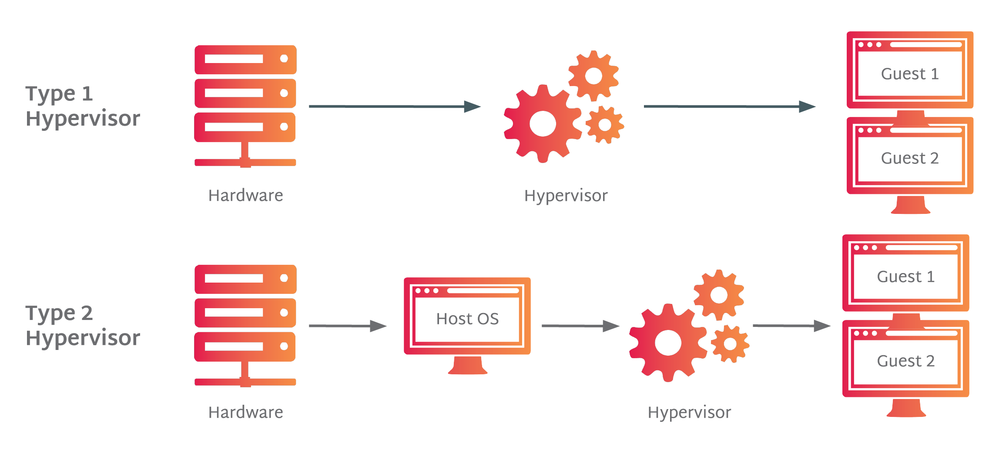
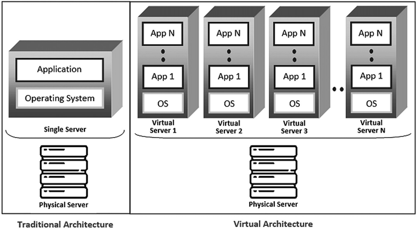
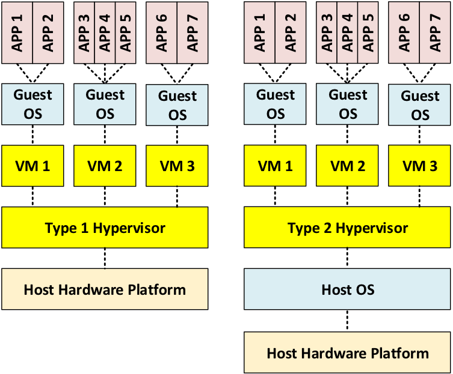
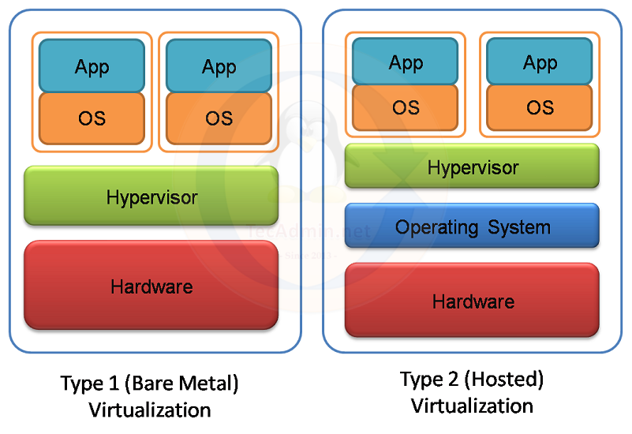

# Cloud Computing

## Cloud = Virtualization + Internet + Automation + Services

### What is Virtualization?

Virtualization means creating a virtual (fake) version of something instead of using real hardware.

Example:
One physical computer can run multiple virtual computers (VMs).

In simple words:
“Using one machine to act like many machines”

Benefits:

- Saves cost
- Better resource usage
- Easy to manage

- Example:
One laptop → run Windows + Linux at same time

---

### What is Cloud Computing?

Cloud computing means using internet-based servers instead of your own computer.

Example:
Instead of storing files on your laptop → store on cloud (like Google Drive)

- Simple definition:
“Accessing storage, servers, and software over the internet”

#### Why use cloud?

- No need to buy expensive hardware
- Access from anywhere
- Scalable (increase/decrease anytime)

---

### What is AWS?

AWS (Amazon Web Services) is a cloud platform that provides services

like:

- Servers
- Storage
- Databases
- Networking

Simple:
“AWS is a platform where you rent computers and services online”

Used by:

- Startups
- Big companies (Netflix, Amazon, etc.)

---

### What is a Virtual Machine (VM)?

A Virtual Machine is a software-based computer that runs inside a real computer.

Simple:

“Computer inside a computer”

Each VM has:

- its own OS (Windows/Linux)
- its own CPU, RAM (virtual)
works independently

- Example:
Running Ubuntu inside your Windows laptop using VirtualBox

---

### Need of Virtualization

#### Why do we use virtualization?

- 1 Better Resource Usage

Without virtualization:

One server = one application (waste)

With virtualization:

One server = multiple applications

- 2 Cost Saving
No need to buy many physical machines
Less hardware cost

- 3 Easy Testing & Development
Run different OS easily
Safe testing (no risk to main system)

- 4 Scalability
Easily create/delete machines
Used in cloud computing

- 5 Isolation
If one VM crashes → others are safe

---

### How Virtualization Works?

There is a special software called:

- Hypervisor

“Manager that creates and controls virtual machines”

Working Flow:

- Physical Machine (Host)
- Hypervisor installed
- Hypervisor creates multiple VMs
- Each VM runs its own OS

Types of Hypervisor:

- Type 1 (Bare Metal)

Runs directly on hardware
Example: VMware ESXi

- Type 2 (Hosted)

Runs on existing OS

- Example: VirtualBox

---

### Virtualization vs Cloud Computing

- Virtualization : Virtualization is a technology.

“It creates multiple virtual machines on one physical system”

It works using a hypervisor

Example : Running Linux on Windows using VirtualBox

 One server → multiple VMs

- Cloud Computing : Cloud Computing is a service.

“Providing computing resources over the internet”

Uses virtualization in backend

Example:

- Using AWS EC2
- Storing files on cloud

| Feature    | Virtualization             | Cloud Computing                |
| ---------- | -------------------------- | ------------------------------ |
| Type       | Technology                 | Service                        |
| Purpose    | Create VMs                 | Provide services over internet |
| Access     | Local system / data center | Internet                       |
| Dependency | Works independently        | Uses virtualization            |
| Example    | VirtualBox, VMware         | AWS, Azure, GCP                |

---

### Relation Between Virtualization and Cloud Computing

“Virtualization is the backbone of cloud computing”

Means:

Cloud = built on virtualization
Without virtualization → cloud not possible

Real Life Understanding

- Virtualization:
You have 1 physical computer → divide into many virtual computers

- Cloud:
You rent those computers over internet

---

### what is VirtualBox ?

VirtualBox is a software that allows you to run virtual machines (VMs) on your computer.

It is developed by Oracle.

Simple:

“VirtualBox lets you run another computer inside your computer”

#### 🔹 What does VirtualBox do?

- Creates virtual machines
- Runs different operating systems
- Manages CPU, RAM, storage for each VM

#### Example:

- You have Windows laptop
- Install VirtualBox
- Run Linux (Ubuntu) inside it

#### 🔹 How it works?

VirtualBox acts as a Type 2 Hypervisor

Meaning:

- It runs on your existing OS (Windows/Mac/Linux)
- Then creates virtual machines

Flow:

- Install VirtualBox
- Create VM
- Install OS inside VM
- Use it like a real computer

#### Why use VirtualBox?

- Learn new OS (Linux, etc.)
- Testing software safely
- No need for extra hardware
- Useful for developers

#### 🔹 Example (Easy to Understand)

You want to learn Linux but don’t want to remove Windows

 Solution:

- Install VirtualBox
- Run Linux inside it

---

### Case 1: One Server → Multiple Applications

Meaning:
One physical server runs many apps directly

Example:
One server runs:

- Website (Node.js)
- Database (MySQL)
- Backend API

All apps share:

- Same OS
- Same CPU & RAM

Problem here:

- If one app crashes → can affect others
- Less isolation

### Case 2: One Server → Multiple VMs

Meaning:
One physical server is divided into multiple virtual computers

Example:
One server creates:

- VM1 → runs website
- VM2 → runs database
- VM3 → runs backend

Each VM has:

- Its own OS
- Its own resources

#### Difference 

| Concept   | Multiple Applications | Multiple VMs          |
| --------- | --------------------- | --------------------- |
| Level     | Software level        | System level          |
| OS        | Same OS               | Different OS possible |
| Isolation | Low                   | High                  |
| Risk      | One crash affects all | Independent           |

- Multiple Apps → sharing same system
- Multiple VMs → separate systems inside one system

---

### Data Center

Cloud companies (like Amazon Web Services) has huge data centers:

- Thousands of physical servers
- Storage systems
- Networking devices

#### 🔹 How Virtualization used there ?

on each physical server:

- Hypervisor has installed

These hypervisor:

- Breaks Server (virtually)
- Makes Multiple VMs

Example:
1 physical server →

- VM1
- VM2
- VM3
- VM4

---

### “Hume jo milta hai cloud me → kya wo VM hi hota hai?”

YES — mostly correct

Example:

AWS EC2 = ek virtual machine hi hai
Ham actually ek isolated VM rent kar rahe hote hai.

#### But Cloud is not only VM

in cloud we get:

#### VM-based services

- like EC2 → Virtual Machine

####  Managed services (No direct VM)

- S3 → storage (no VM visible)
- RDS → database (VM hidden)
- Lambda → serverless (no VM visible)

#### Simple

Virtualization use ho rahi hai backend me, but tumhe VM dikh bhi sakta hai ya nahi bhi

---

### Isolation ka concept (Important)

“hume ek small piece milta hai isolated”

Jab tum EC2 lete ho:

- Tumhe CPU ka part milta hai
- RAM ka part milta hai
- Storage ka part milta hai

But:

- Wo fully isolated hota hai
- Dusre users interfere nahi kar sakte

#### Ye sab possible hai because of:

Virtualization

---

### Simple Flow

Physical Server (Data Center)\
        ↓\
Hypervisor (Virtualization)\
        ↓\
Multiple Virtual Machines (VMs)\
        ↓\
Cloud Services (EC2, RDS, etc.)\
        ↓\
User (You)

---

### “Cloud computing uses virtualization to divide physical resources into multiple isolated virtual machines. These virtual machines are then offered as services over the internet. In many cases like EC2, users directly interact with VMs, while in managed services like S3 or RDS, virtualization is used internally but hidden from the user.”

---

### What is Hypervisor?

A Hypervisor is a software (or firmware) that creates and manages virtual machines (VMs).

#### What does Hypervisor do?

- Physical resources (CPU, RAM, Storage) ko divide karta hai
- Multiple VMs banata hai
- Har VM ko isolated rakhta hai
- Resources allocate karta hai

Basically:

“Ek system ko multiple virtual systems me convert karta hai”

#### How Hypervisor Works?

Flow:

- Physical Machine (Server)
- Hypervisor install hota hai
- Hypervisor creates multiple VMs
- Har VM apna OS run karta hai

---

### 🔹 Types of Hypervisor

Type 1 (Bare Metal):

- Direct hardware pe run karta hai
- Koi OS nahi hota beech me

Fast + powerful

👉 Used in cloud (AWS, Azure)

Example:

- VMware ESXi
- Microsoft Hyper-V

Type 2 (Hosted):

- Existing OS ke upar run karta hai

- Easy for learning

- Used on personal computers

Example:

- VirtualBox
- VMware Workstation

#### Key Difference

| Type   | Runs On         | Use Case               |
| ------ | --------------- | ---------------------- |
| Type 1 | Direct hardware | Cloud, Data centers    |
| Type 2 | On OS           | Personal use, learning |

---

### Q1: VM me OS pehle se hota hai ya install karna padta hai?

